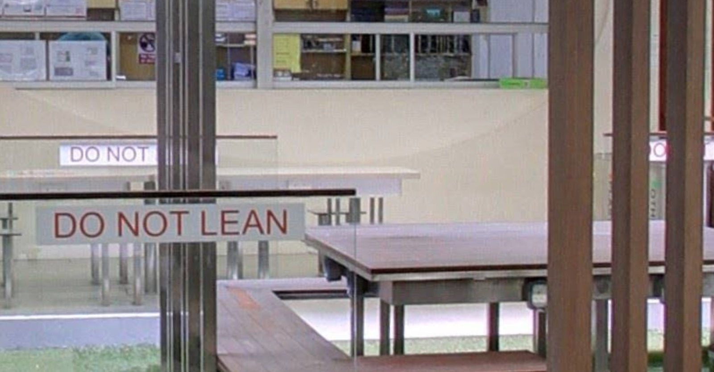

## Where's Wally?

### Description
Oh no! Wally went missing again. He sent you 3 screenshots of 3 different locations and requires your help!
The flag is in the format FLAG{AAAAAA_BBBBBB_CCCCCC} where each string of identical letters represents a 6-digit postal code in Singapore. Note that the order of the photos matters.

### Files

 

 

